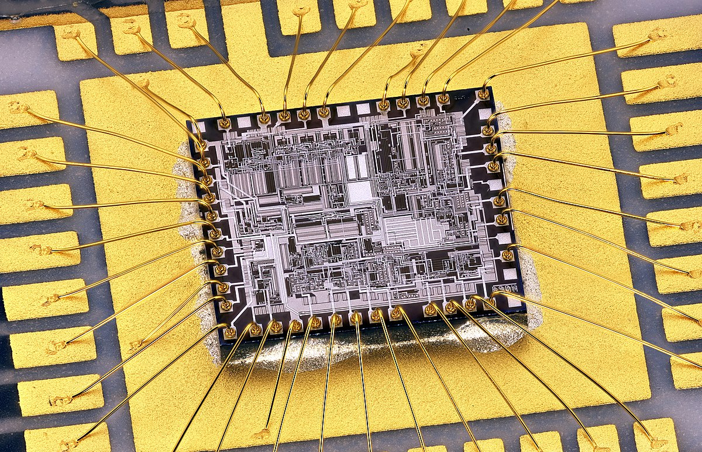
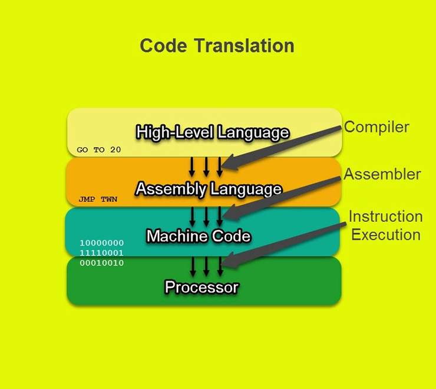
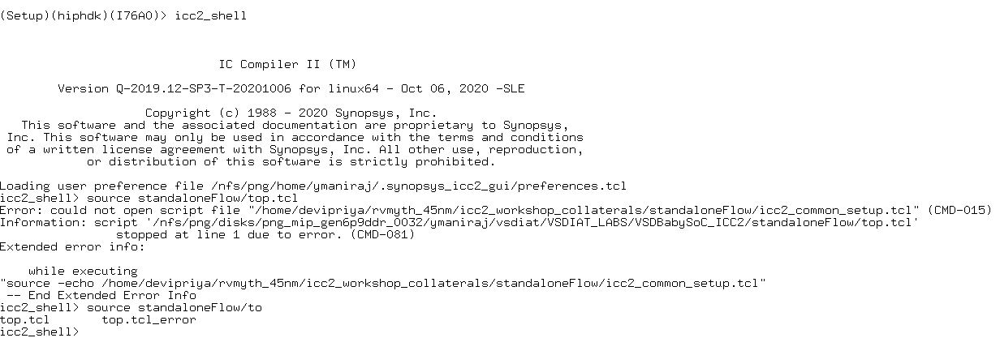

# SD Training 
Content of training:
- [Day_0 : System/Tool Setup Check. GitHub ID creation](https://github.com/YishenKuma/sd_training/edit/main/readme.md#day_0--systemtool-setup-check-github-id-creation)

> - [Lecture_0](https://github.com/YishenKuma/sd_training/blob/main/readme.md#lecture-topics)
> - [Lab_0](https://github.com/YishenKuma/sd_training/blob/main/readme.md#lab-session)

- [Day_1 : Introduction to iverilog design test bench](https://github.com/YishenKuma/sd_training/blob/main/readme.md#day_1--introduction-to-iverilog-design-test-bench)

> - [Lecture_1 + VSD-IAT recording topics](https://github.com/YishenKuma/sd_training/blob/main/readme.md#lecture--vsd-iat-recordining-topics))
> - [Lab_1](https://github.com/YishenKuma/sd_training/blob/main/readme.md#lab-day_1)

## **Day_0 : System/Tool Setup Check. GitHub ID creation** 
### Lecture Topics
* Chip and Package
<!---

--->
 

Chip: The assembly of active and passive electronic components, along with their inetrconnections, fabricated as a single unit on a thin substrate of semiconductor material.

Package: The housing that chips are placed in. The package is then either plugged into or soldered onto the printed circuit board. 

* Wire bonding
<!---

--->

Wire bonds are the interconnections between an integrated circuit (IC) or other semiconductor device and its packaging during semiconductor device fabrication.

* Core and IO
<!---

--->

Core: the section of the chip where the fundamental logic of the design is placed (Macros, IPs, Etc,.)

IO: allows the communication of data between die and external components

IO Pads: acting as gateway, connecting internal signals from the core of the integrated circuit to the external pins of the chip package

* Macros and IPs
<!---

--->

Macros: Simple custom built cell serving a sepecific funtional purpose that can be found through open sources

Foundry IPs: Macro cells developed with the intent of licencing to multiple vendor for using as building blocks in different chip designs, known as Intellectual Property 

* Communication between software and hardware
<!---

--->
 

Compiler: reads the complete source program written in high-level language as a whole in one go and translates it into an equivalent program in assembly language

Assembler: translate the program written in assembly language into machine code represented by binary code

### Lab session

#### Steps

[Setup](https://github.com/YishenKuma/sd_training/blob/main/scripts/github_lab0.txt)

#### Results

<!---

--->
 

> error encountered after source standaloneHome/top.tcl

## **Day_1 : Introduction to iverilog design test bench** 
### Lecture + VSD-IAT recordining Topics 
* RTL
* HDL
* RTL Deisgn
* Logic synthesis
* iverilog
* gktkwave
* Design
* Testbench
* Netlist
* Verilog files
* Library files
* Clock timing and frequency claculation
* Setup and Hold 
* Selection of cells

### Lab Day_1

remote spark ubuntu terminal for coding

cloning github repo in vlsi directory

loading verilog files into simulator, and executing output vcd file for viewing in gtkwave

verilog file used and corresponding testbench file used

loading yoysy softqware to be used for synthesis

reading library and verilog files, then performing synthesis using command "synth -top good_mux"

generating the netlist using command "abc -liberty *lib_path*"

shows graphical representation of realized logic

verilog file written from netlist produced

simplified verilog file written using the -noattr switch 
